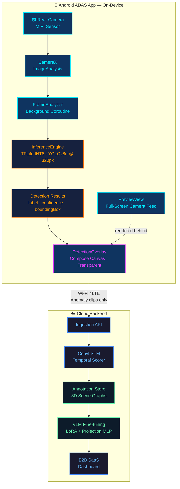
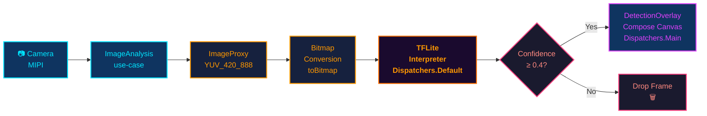
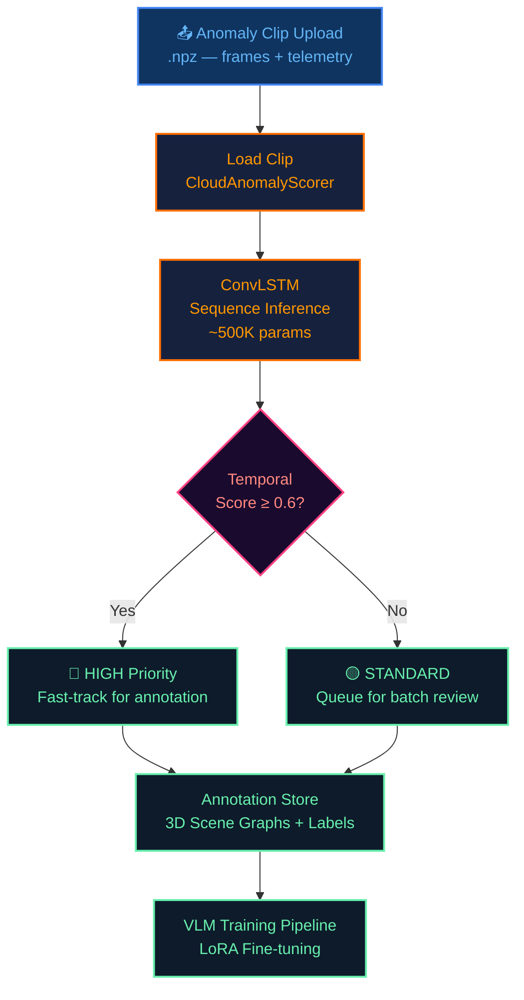

<div align="center">

# 🚗 ADAS — AI Dashcam for Indian Roads

**A full-stack, on-device Advanced Driver Assistance System built for India's chaotic, unstructured traffic — powered by a native Android app running real-time object detection entirely on your smartphone's camera, with zero cloud dependency.**

[](#-android-adas-app)
[](#tech-stack)
[](#inference-engine)
[](#camerax-pipeline)
[](#️-download--install)
[](#)

</div>

---

## 📑 Table of Contents

- [The Problem — Why India Needs Its Own ADAS](#-the-problem--why-india-needs-its-own-adas)
- [The Solution — Phone as the Edge Node](#-the-solution--phone-as-the-edge-node)
- [System Architecture](#️-system-architecture)
- [Android ADAS App](#-android-adas-app)
  - [CameraX Pipeline](#camerax-pipeline)
  - [Inference Engine](#inference-engine)
  - [Detection Overlay](#detection-overlay)
- [Cloud Backend](#️-cloud-backend)
- [Legacy Edge Modules](#-legacy-edge-modules-python)
- [ESP32-P4 Firmware](#-esp32-p4-eye-firmware-archived)
- [Download & Install](#️-download--install)
- [Build from Source](#️-build-from-source)
- [Plugging in a Real Model](#-plugging-in-a-real-tflite-model)
- [Tech Stack](#-tech-stack)
- [Roadmap](#-roadmap)
- [License](#-license)

---

## 🇮🇳 The Problem — Why India Needs Its Own ADAS

Standard ADAS systems are trained on orderly Western roads — clear lane markings, rule-following drivers, predictable intersections. They **consistently fail in India**.

| Problem | Root Cause |
|---------|-----------|
| False emergency braking | Autorickshaws cutting lanes, hand-painted road signs |
| Sensor confusion | Missing lane markings, unmarked speed bumps |
| Animal blindness | Cows, dogs, camels as static road obstacles |
| Weather failure | Monsoon rain, dust storms, unlit night roads |
| Intersection deadlock | Unregulated multi-way junctions |

> **The bottleneck isn't compute power — it's the absence of India-specific, edge-case-rich training data.**

Western open datasets (nuScenes, Waymo, KITTI) contain essentially zero representation of Indian road conditions.

---

## 💡 The Solution — Phone as the Edge Node

Instead of dedicated hardware, we turn every Android phone into an ADAS sensor:

- 📷 **Camera** — High-resolution sensor already built in
- 🧠 **NPU/GPU** — Runs quantized TFLite models at real-time frame rates
- 📡 **Connectivity** — Wi-Fi / LTE already present for selective cloud upload
- 🔋 **Power** — Charged via car USB / wireless pad

This eliminates the need for a Raspberry Pi, ESP32, or any dedicated hardware — your daily driver phone **is** the edge node.

---

## 🏗️ System Architecture

### Full System — Edge to Cloud



### On-Device Inference Pipeline



### Cloud Anomaly Scoring Pipeline



---

## 📱 Android ADAS App

The app is written in **Kotlin with Jetpack Compose**. It is a single-activity application that:

1. Requests camera permission at runtime
2. Opens the rear camera full-screen via `CameraX PreviewView`
3. Extracts frames on a background coroutine via `CameraX ImageAnalysis`
4. Runs TFLite detection inference without blocking the UI thread
5. Draws colored bounding boxes on a transparent Compose Canvas overlay

### CameraX Pipeline

**[`AdasCameraScreen.kt`](android_app/app/src/main/java/com/example/adas/AdasCameraScreen.kt)**

Binds two CameraX use-cases simultaneously in a `LaunchedEffect`:

| Use-case | Purpose |
|----------|---------|
| `Preview` | Renders the live camera feed into a `PreviewView` |
| `ImageAnalysis` | Delivers `ImageProxy` frames to `FrameAnalyzer` |

```kotlin
val imageAnalysis = ImageAnalysis.Builder()
    .setResolutionSelector(ResolutionSelector.Builder()
        .setResolutionStrategy(ResolutionStrategy(Size(640, 480), FALLBACK_RULE_CLOSEST_HIGHER_THEN_LOWER))
        .build())
    .setBackpressureStrategy(STRATEGY_KEEP_ONLY_LATEST) // drop stale frames
    .build()
    .also { it.setAnalyzer(executor, analyzer) }

cameraProvider.bindToLifecycle(lifecycleOwner, BACK_CAMERA, preview, imageAnalysis)
```

**[`FrameAnalyzer.kt`](android_app/app/src/main/java/com/example/adas/FrameAnalyzer.kt)**

Implements `ImageAnalysis.Analyzer`. Uses CameraX's built-in `ImageProxy.toBitmap()` extension for efficient YUV→Bitmap conversion, then launches inference on `Dispatchers.Default`.

```kotlin
override fun analyze(image: ImageProxy) {
    val bitmap = image.toBitmap()   // CameraX built-in extension
    image.close()
    analyzerScope.launch {
        val results = engine.detect(bitmap)
        withContext(Dispatchers.Main) { onResults(results) }
    }
}
```

### Inference Engine

**[`InferenceEngine.kt`](android_app/app/src/main/java/com/example/adas/InferenceEngine.kt)**

Provides a `suspend fun detect(bitmap: Bitmap): List<Detection>` that runs on `Dispatchers.Default`.

- **Mock mode (default):** Ships with animated deterministic bounding boxes (vehicle, person, motorcycle) so the overlay renders and can be validated immediately without a model file.
- **Real mode:** Drop a `.tflite` file in `assets/` and uncomment the `Interpreter` block. See [Plugging in a Real Model](#-plugging-in-a-real-tflite-model).

```kotlin
data class Detection(
    val label: String,
    val confidence: Float,
    val boundingBox: RectF  // normalized [0,1] coordinates
)
```

### Detection Overlay

**[`DetectionOverlay.kt`](android_app/app/src/main/java/com/example/adas/DetectionOverlay.kt)**

A Compose `Canvas` composable layered over the `PreviewView`. On every new `List<Detection>` it draws:

- **Colored bounding box** — each class has a distinct color (Cyan = vehicle, Pink = person, Amber = motorcycle)
- **Corner accent marks** — tactical HUD-style corner brackets
- **Label badge** — filled rectangle with class name + confidence percentage

Color mapping:
```kotlin
val labelColors = mapOf(
    "vehicle"    to Color(0xFF00E5FF),  // Cyan
    "person"     to Color(0xFFFF4081),  // Pink
    "motorcycle" to Color(0xFFFFD740),  // Amber
    "truck"      to Color(0xFF69F0AE),  // Green
    "bus"        to Color(0xFFE040FB),  // Purple
)
```

---

## ☁️ Cloud Backend

The cloud side receives anomaly clips and telemetry from the app over Wi-Fi/LTE. Code lives in `cloud_backend/`.

| File | Role |
|------|------|
| `cloud_scorer.py` | Loads `.npz` frame clips, runs ConvLSTM inference, returns enriched JSON with temporal anomaly score |

The **ConvLSTM** (~500K parameters) processes sequences of frames to detect time-dependent anomalies (e.g., a vehicle that *suddenly* swerves, rather than just one that exists in a frame).

```python
from cloud_backend.cloud_scorer import CloudAnomalyScorer

scorer = CloudAnomalyScorer()
scorer.load_model()

result = scorer.score_clip("clips/20260403_031425_clip.npz")
print(result.temporal_score)      # 0.78
print(result.is_critical_anomaly) # True
```

---

## 🐍 Legacy Edge Modules (Python)

The original Raspberry Pi Python pipeline is preserved in `legacy_python_edge/src/` as a reference implementation and for development/testing purposes.

| Module | What it does |
|--------|-------------|
| `camera_module.py` | Threaded OpenCV frame capture into a ring buffer |
| `obd_simulator.py` | Generates realistic OBD-II telemetry at 10 Hz (speed, RPM, steering, brake) |
| `active_learner.py` | YOLOv8n inference + active learning uncertainty scoring |
| `adaptive_threshold.py` | Environment-aware dynamic anomaly threshold (adapts to night, rain, traffic) |
| `kalman_tracker.py` | Multi-object Kalman tracker with persistent IDs and trajectory analysis |
| `clip_buffer.py` | Rolling 2-second frame window; flushes to `.npz` on anomaly trigger |
| `temporal_model.py` | ConvLSTM network definition (~500K params, PyTorch) |
| `data_logger.py` | Synchronized JPEG frame + JSON telemetry writer |
| `main.py` | `EdgeDashPipeline` orchestrator — starts all threads, runs main loop |

### Run the Python Pipeline

```bash
cd legacy_python_edge

# Install dependencies
pip install -r ../requirements.txt

# Optional: download YOLOv8n weights
python -c "from ultralytics import YOLO; YOLO('yolov8n.pt')"
mv yolov8n.pt models/

# Run (works without Pi, camera, or real OBD hardware — all mocked)
python -m src.main
```

### Automated Tests (78 total)

```bash
python -m pytest ../tests/ -v

# By suite:
python -m pytest ../tests/test_kalman_tracker.py -v       # 30 tests
python -m pytest ../tests/test_adaptive_threshold.py -v   # 21 tests
python -m pytest ../tests/test_temporal.py -v             # 27 tests
```

| Suite | Tests | Coverage |
|-------|:-----:|----------|
| `test_kalman_tracker` | 30 | IoU computation, greedy matching, predict/update, trajectory scoring |
| `test_adaptive_threshold` | 21 | Environment classification, threshold clamping, sensitivity multipliers |
| `test_temporal` | 27 | ClipBuffer ops, ConvLSTM shapes, MockTemporalScorer, CloudAnomalyScorer |

---

## 🔌 ESP32-P4-EYE Firmware (Archived)

An intermediate hardware exploration — a FreeRTOS/C++ firmware scaffold for the ESP32-P4-EYE microcontroller. Archived in `esp32_firmware/` for reference.

| File | Role |
|------|------|
| `main.cpp` | `app_main()` entry point — spawns FreeRTOS tasks |
| `camera_task.cpp` | MIPI-CSI camera capture stub |
| `inference_task.cpp` | ESP-DL TFLite inference stub |
| `h264_encoder_task.cpp` | Hardware H.264 encoder / rolling buffer stub |
| `can_obd_task.cpp` | TWAI (CAN bus) OBD-II communication stub |
| `kalman_tracker.cpp` | C++ Kalman filter implementation |
| `yolov8_quantization_guide.md` | Steps to convert `.pt` → INT8 `.tflite` for ESP-DL |

> The ESP32-P4 architecture was superseded by the Android app, which provides superior processing power, camera quality, and connectivity with zero additional hardware cost.

---

## ⬇️ Download & Install

> Works on any Android phone running **Android 7.0 (API 24) or higher**.

**APK path in this repo:**
```
android_app/app/build/outputs/apk/debug/app-debug.apk   (~27 MB)
```

### Option 1 — ADB (Recommended)

```powershell
# Enable Developer Options → USB Debugging on your phone
# Connect via USB, then run from the project root:

$env:PATH += ";C:\Users\MANISH KUMAR\AppData\Local\Android\Sdk\platform-tools"
adb install android_app\app\build\outputs\apk\debug\app-debug.apk
```

### Option 2 — Direct Sideload

1. Transfer `app-debug.apk` to your phone (USB / Google Drive / email)
2. **Settings → Apps → Special App Access → Install Unknown Apps** → allow your file manager
3. Tap the APK file to install

> ⚠️ **Debug build only.** For a release build, run `./gradlew assembleRelease` and sign with your keystore.

---

## 🛠️ Build from Source

### Prerequisites

| Tool | Version | Purpose |
|------|---------|---------|
| JDK | 17+ | Gradle build system |
| Android SDK | API 36 | Build target |

### Steps

```bash
# 1. Clone the repo
git clone https://github.com/BHUKKADDD/ADAS.git
cd ADAS/android_app

# 2. Build the debug APK
./gradlew assembleDebug

# APK output:
# app/build/outputs/apk/debug/app-debug.apk

# 3. Install directly (device must be connected via ADB)
./gradlew installDebug
```

On first build, Gradle will automatically download all dependencies (CameraX, TFLite, Accompanist). This takes ~2–3 minutes.

---

## 🧠 Plugging in a Real TFLite Model

The `InferenceEngine` ships with mock detections. Replacing them with a real model takes 3 steps:

### Step 1 — Export YOLOv8n to TFLite

```bash
pip install ultralytics
yolo export model=yolov8n.pt format=tflite imgsz=320
# Output: yolov8n_float32.tflite (or int8 if calibration provided)
```

For maximum performance on Android, use INT8 quantization:
```bash
yolo export model=yolov8n.pt format=tflite imgsz=320 int8=True
```

### Step 2 — Add to Assets

```
android_app/app/src/main/assets/yolov8n.tflite
```

### Step 3 — Uncomment Interpreter Code

In [`InferenceEngine.kt`](android_app/app/src/main/java/com/example/adas/InferenceEngine.kt), uncomment the `Interpreter` block and replace the mock output section with real tensor I/O:

```kotlin
// 1. Load model
val model = FileUtil.loadMappedFile(context, "yolov8n.tflite")
val options = Interpreter.Options().apply { numThreads = 4 }
val interpreter = Interpreter(model, options)

// 2. Preprocess bitmap → input tensor
// 3. Run: interpreter.run(inputTensor, outputBuffer)
// 4. Parse output boxes + scores → List<Detection>
```

---

## 💻 Tech Stack

### 📱 Android App

| Component | Technology |
|-----------|-----------|
| Language | Kotlin |
| UI | Jetpack Compose |
| Camera | CameraX 1.4.2 (Preview + ImageAnalysis) |
| ML Inference | TensorFlow Lite 2.16 |
| Concurrency | Kotlin Coroutines |
| Permissions | Accompanist Permissions 0.37 |
| Build System | Gradle 9.1 + AGP 9.0 |
| Min SDK | API 24 (Android 7.0) |
| Target SDK | API 36 |

### 🐍 Cloud Backend & Legacy Python

| Component | Technology |
|-----------|-----------|
| Language | Python 3.9+ |
| Object Detection | Ultralytics YOLOv8 Nano |
| Computer Vision | OpenCV (headless) |
| Object Tracking | Custom 7D Kalman Filter (NumPy) |
| Temporal Model | ConvLSTM (PyTorch, cloud-only, ~500K params) |
| Inference Runtime | ONNX Runtime (ARM-optimized) |
| CAN Bus | python-can / custom mock simulator |
| Image Processing | Pillow, NumPy |
| Testing | pytest (78 tests) |

---

## 🗺️ Roadmap

- [x] **Phase 1 — Python Edge MVP** *(Complete)*
  - [x] Threaded OpenCV capture with ring buffer
  - [x] YOLOv8 Nano inference + active learning uncertainty scoring
  - [x] OBD-II telemetry simulation (10 Hz mock)
  - [x] Memory-safe pipeline with GC and resource monitoring

- [x] **Phase 1.5 — Advanced Edge Intelligence** *(Complete)*
  - [x] Multi-object Kalman tracker with persistent IDs
  - [x] Trajectory anomaly detection (erratic motion scoring)
  - [x] Adaptive threshold with automatic environment classification
  - [x] Rolling clip buffer for temporal context capture
  - [x] ConvLSTM spatio-temporal anomaly scorer (cloud-side)
  - [x] 78 automated tests with full coverage

- [x] **Phase 2 — Android ADAS App** *(Complete)*
  - [x] Native Android app (Kotlin + Jetpack Compose)
  - [x] Full-screen CameraX rear camera preview
  - [x] Asynchronous background inference pipeline (Coroutines)
  - [x] TensorFlow Lite inference engine scaffold
  - [x] Real-time transparent bounding box overlay with class colors
  - [x] Runtime camera permission gating
  - [x] Debug APK built and ready to install

- [ ] **Phase 3 — Real Model Integration**
  - [ ] Plug in YOLOv8n INT8 `.tflite` model trained on Indian road data
  - [ ] OBD-II Bluetooth integration via ELM327 BLE adapter
  - [ ] GNSS geolocation tagging on each anomaly packet
  - [ ] Selective Wi-Fi / LTE upload to cloud ingestion API
  - [ ] On-device PII blurring (face + license plate, MediaPipe)

- [ ] **Phase 4 — Cloud Platform**
  - [ ] Data lake ingestion pipeline (AWS S3 / GCS)
  - [ ] 3D scene graph annotation pipeline
  - [ ] VLM fine-tuning infrastructure (LoRA + Projection MLP)
  - [ ] B2B SaaS dashboard for OEM customers

- [ ] **Phase 5 — Consumer & Scale**
  - [ ] DePIN tokenomics (data contribution rewards)
  - [ ] Usage-based insurance API integration
  - [ ] Driver drowsiness detection (face landmark model)
  - [ ] Forward collision warning audio alerts
  - [ ] Fleet management portal
  - [ ] Multi-market expansion (Southeast Asia, Africa, LATAM)

---

## 📁 Repository Structure

```
ADAS/
├── android_app/                        # 📱 Native Android ADAS App
│   ├── app/
│   │   ├── src/main/
│   │   │   ├── java/com/example/adas/
│   │   │   │   ├── MainActivity.kt     # Entry point + permission gate
│   │   │   │   ├── AdasCameraScreen.kt # CameraX binding + layout
│   │   │   │   ├── FrameAnalyzer.kt    # Background frame extractor
│   │   │   │   ├── InferenceEngine.kt  # TFLite wrapper (mock + real)
│   │   │   │   ├── DetectionOverlay.kt # Compose Canvas overlay
│   │   │   │   └── Detection.kt        # Data class
│   │   │   └── assets/                 # ← Put yolov8n.tflite here
│   │   └── build/outputs/apk/debug/
│   │       └── app-debug.apk           # ⬇️ Prebuilt APK (~27 MB)
│   ├── build.gradle.kts
│   └── gradle/libs.versions.toml
│
├── cloud_backend/                      # ☁️ Cloud-side scoring
│   └── cloud_scorer.py                 # ConvLSTM clip inference
│
├── legacy_python_edge/                 # 🐍 Original Raspberry Pi code
│   └── src/
│       ├── main.py                     # Pipeline orchestrator
│       ├── camera_module.py
│       ├── obd_simulator.py
│       ├── active_learner.py
│       ├── adaptive_threshold.py
│       ├── kalman_tracker.py
│       ├── clip_buffer.py
│       └── temporal_model.py
│
├── esp32_firmware/                     # 🔌 ESP32-P4 C++ firmware (archived)
│   └── main/
│       ├── main.cpp
│       ├── camera_task.cpp
│       ├── inference_task.cpp
│       ├── h264_encoder_task.cpp
│       ├── can_obd_task.cpp
│       └── kalman_tracker.cpp
│
├── tests/                              # 78 automated tests (pytest)
├── requirements.txt
└── README.md
```

---

## 📄 License

MIT — See [LICENSE](LICENSE) for details.

---

<div align="center">

**A personal project by [Sushant](https://github.com/BHUKKADDD)**

**🇮🇳 Making India's roads safer, one edge case at a time.**

</div>
